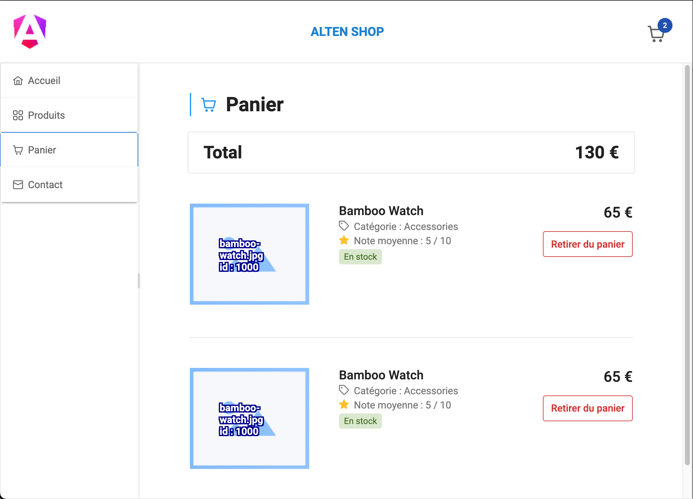

# Getting started
## Contexte
Ce projet est un exercice réalisé par Jean Sordes, en 3 jours de travail, dans le cadre d'un test technique pour l'entreprise Alten.

Le front a nécessité 2,5 jours de travail, le back 0,5 jours de travail

## Stack technique
C'est une application constitué d'un front en [Angular](https://angular.dev/) + [PrimeNG](https://primeng.org/) (Librairie CSS), et d'un back réalisé en NodeJS + SQLite

## Installation
1. Clonez le projet sur votre machine
2. Installer les dépendances (`npm i`)
3. Lancez le back, puis le front (`npm start` dans les deux cas)





# Consignes reçues

> - Vous êtes développeur front-end : vous devez réaliser les consignes décrites dans le chapitre [Front-end](#Front-end)
> - Vous êtes développeur back-end : vous devez réaliser les consignes décrites dans le chapitre [Back-end](#Back-end) (*)
> - Vous êtes développeur full-stack : vous devez réaliser les consignes décrites dans le chapitre [Front-end](#Front-end) et le chapitre [Back-end](#Back-end) (*)
> (*) Afin de tester votre API, veuillez proposer une stratégie de test appropriée.

## Front-end

> Le site de e-commerce d'Alten a besoin de s'enrichir de nouvelles fonctionnalités.

### Partie 1 : Shop

- [x] [Issue #1](https://github.com/jeansordes/alten-exercise/issues/1) Afficher toutes les informations pertinentes d'un produit sur la liste
- [x] [Issue #2](https://github.com/jeansordes/alten-exercise/issues/2) Permettre d'ajouter un produit au panier depuis la liste 
- [x] [Issue #3](https://github.com/jeansordes/alten-exercise/issues/3) Permettre de supprimer un produit du panier
- [x] [Issue #4](https://github.com/jeansordes/alten-exercise/issues/4) Afficher un badge indiquant la quantité de produits dans le panier
- [x] [Issue #5](https://github.com/jeansordes/alten-exercise/issues/5) Permettre de visualiser la liste des produits qui composent le panier.

### Partie 2

- [x] [Issue #6](https://github.com/jeansordes/alten-exercise/issues/6) Créer un nouveau point de menu dans la barre latérale ("Contact")
- [x] [Issue #7](https://github.com/jeansordes/alten-exercise/issues/7) Créer une page "Contact" affichant un formulaire
- [x] [Issue #8](https://github.com/jeansordes/alten-exercise/issues/8) Le formulaire doit permettre de saisir son email, un message et de cliquer sur "Envoyer"
- [x] [Issue #9](https://github.com/jeansordes/alten-exercise/issues/9) Email et message doivent être obligatoirement remplis, message doit être inférieur à 300 caractères.
- [x] [Issue #10](https://github.com/jeansordes/alten-exercise/issues/10) Quand le message a été envoyé, afficher un message à l'utilisateur : "Demande de contact envoyée avec succès".

### Bonus : 

- [ ] [Issue #11](https://github.com/jeansordes/alten-exercise/issues/11) Ajouter un système de pagination et/ou de filtrage sur la liste des produits
- [ ] [Issue #12](https://github.com/jeansordes/alten-exercise/issues/12) On doit pouvoir visualiser et ajuster la quantité des produits depuis la liste et depuis le panier 

## Back-end

> Développer un back-end permettant la gestion de produits définis plus bas.
> Vous pouvez utiliser la technologie de votre choix parmi la liste suivante :
>
> - **Node.js/Express (c'est cette option qui a été choisie)**
> - Java/Spring Boot
> - C#/.net Core
> - PHP/Symphony
>
> Le back-end doit gérer les API suivantes : 
> 
> | Resource           | POST                  | GET                            | PATCH                                    | PUT | DELETE           |
> | ------------------ | --------------------- | ------------------------------ | ---------------------------------------- | --- | ---------------- |
> | **/products**      | Create a new product  | Retrieve all products          | X                                        | X   |     X            |
> | **/products/:id**  | X                     | Retrieve details for product 1 | Update details of product 1 if it exists | X   | Remove product 1 |
> 
> Un produit a les caractéristiques suivantes : 
>
> ``` typescript
> class Product {
>   id: number;
>   code: string;
>   name: string;
>   description: string;
>   image: string;
>   category: string;
>   price: number;
>   quantity: number;
>   internalReference: string;
>   shellId: number;
>   inventoryStatus: "INSTOCK" | "LOWSTOCK" | "OUTOFSTOCK";
>   rating: number;
>   createdAt: number;
>   updatedAt: number;
> }
> ```
>
> Le back-end créé doit pouvoir gérer les produits dans une base de données SQL/NoSQL ou dans un fichier json.

- [x] [Issue #13](https://github.com/jeansordes/alten-exercise/issues/13) /products GET
- [x] [Issue #14](https://github.com/jeansordes/alten-exercise/issues/14) /products POST
- [x] [Issue #18](https://github.com/jeansordes/alten-exercise/issues/18) /products/:id GET
- [x] [Issue #20](https://github.com/jeansordes/alten-exercise/issues/20) /products/:id PATCH
- [x] [Issue #22](https://github.com/jeansordes/alten-exercise/issues/22) /products/:id DELETE

## Bonus

- [x] [Issue #23](https://github.com/jeansordes/alten-exercise/issues/23) Vous pouvez ajouter des tests Postman ou Swagger pour valider votre API
    - Remarque : Dans ce projet, j'ai fais mes tests en utilisant Insomnia (Alternative à Postman, [disponible ici](https://insomnia.rest/download)) [Voir la documentation de Postman](https://learning.postman.com/docs/getting-started/importing-and-exporting/importing-from-insomnia/) pour importer le fichier `api-tests.insomnia.json` dans Postman